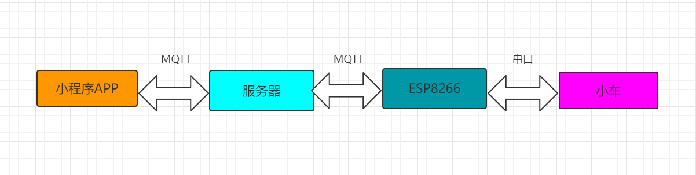

# 简介

WiFi 智能小车，是自己从零开始了解学习的，在此之前，Arduino 也是边学习便了解的。所以智能小车，针对任何感兴趣的小伙伴，包括小白，都可以很好入门学习的。分享 WiFi 智能小车的初衷，希望大家一起成长，一起在热爱科技的道路上走得更远！

如在实践过程中，遇到问题，可关注下方的抖音号，私信我。我会不定期抽空回复大家的问题，也可加入我的抖音粉丝群。

# 工作原理

WiFi 智能小车，有三大部分组成：小程序，服务端 和 硬件（包括小车和 ESP8266）

- 小程序  
  小程序首先发送指令给服务端。小程序和服务端的数据传输采用 MQTT 协议。采用 MQTT 协议的原因是，服务器也能将小车的在线/离线状态 发送给 小程序。

- 服务端  
  连接小程序和小车硬件。服务端既可以将小程序的指令通过 MQTT 发送给小车，也可以通过 MQTT 协议将小车的在线/离线状态发送给小程序。

- 硬件  
  硬件有两部分组成：小车车体 和 ESP8266 的 WiFi 模块。  
  小车车体和 ESP8266 是通过串口进行通信的。而 ESP8266 再通过 MQTT 协议和服务端进行通信的。

- 总结  
  通过以上三大模块的数据传输，就可以清晰的看到他们之间的工作原理了。

# 目录说明

[arduino]: https://www.arduino.cc/en/Guide/
[小程序]: https://developers.weixin.qq.com/miniprogram/dev/framework/
[nodejs]: https://nodejs.org/en/

- sr/smart-car-arduino  
  这一部分是硬件部分的源码，主要由 arduino 编写的，包含 ESP8266 的部分和小车的部分。更多 ardino 的介绍，可参考 [arduino][] 的说明

- src/smart-car-mini  
  这一部分是小程序部分的源码，如果在阅读过程中，碰到问题，可参考 [小程序][] 的文档说明
- src/smart-car-server  
  这一部分是服务端部分的源码，主要是 Nodejs 编写的，如果在阅读过程中，碰到问题，可参考 [Nodejs][] 的文档说明。

# 捐赠

如果觉得此项目对大家有帮助，可扫码下方的抖音号，关注我，进我店铺支持一哈，嘻嘻，有键盘鼠标等数码产品，如有需要可购买哈。

# 联系我

# License

[mit]: LICENSE

[MIT][]

Copyright (c) 2022-present drinkingcode
